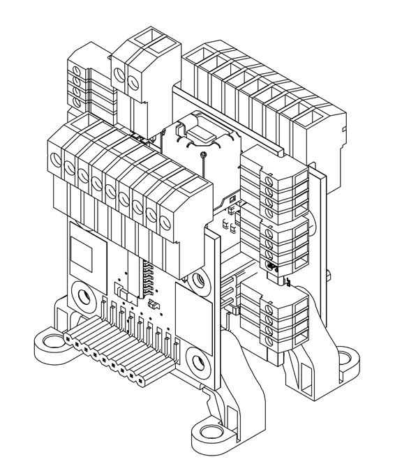

# io_decoder  

## Description
io_decoder is a HAL component for Linuxcnc. It allows control, through a USB connection, of the inputs and outputs needed to manage a CNC machine operator panel.  
  
**Watch the system in action:**  

  
* [📖 Full description of the project in English](./docs/README.en.md)
* [🏠 Project Home in English](https://bobwolfrst.github.io/io_decoder-linuxCNC/index)  
* [🚀 Demo/Eval mode in English](https://bobwolfrst.github.io/io_decoder-linuxCNC/demo_mode.en)  
* [🛒 Get the Hardware: Ready-to-use kits are available on eBay here (Limited stock: 5 units)](https://www.ebay.it/itm/277867309687)

## Descrizione
io_decoder è un componente di HAL per Linuxcnc. Permette di controllare, attraverso una connessione USB, gli input e gli output che servono per gestire un pannello operatore di macchina CNC. 
  
**Guarda il sistema in funzione:**  

  
* [📖 Descrizione completa del progetto in italiano](./docs/README.it.md)  
* [🏠 Project Home in Italiano](https://bobwolfrst.github.io/io_decoder-linuxCNC/index.it)  
* [🚀 Demo/Eval mode in Italiano](https://bobwolfrst.github.io/io_decoder-linuxCNC/demo_mode.it)
* [🛒 Ottieni l'Hardware:Kit pronti all'uso disponibili su eBay (Stock limitato: 5 unità)](https://www.ebay.it/itm/277867309687)

Copyright (c) 2026 [bobwolf]
  

<footer style="padding: 20px 0; text-align: center; color: #666; font-size: 0.9em;">
  
<strong>io_decoder</strong> - Driver Open Source per LinuxCNC

  

    <a href="mailto:io.decoder.rst%40gmail.com" style="color: #1e6bb8; text-decoration: none;">✉️ Contact</a> | 
  

  
© 2026 - Creato da bobwolfrst. Rilasciato sotto licenza GPL.
 
</footer>
