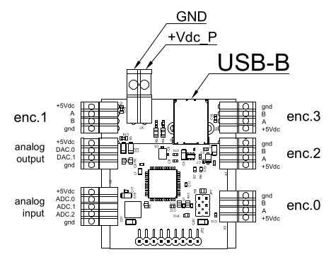
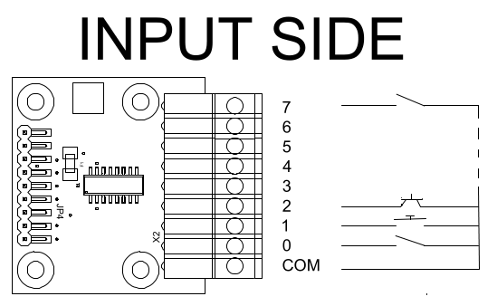
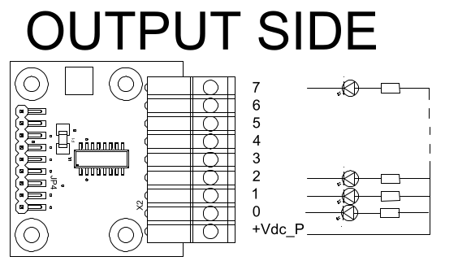
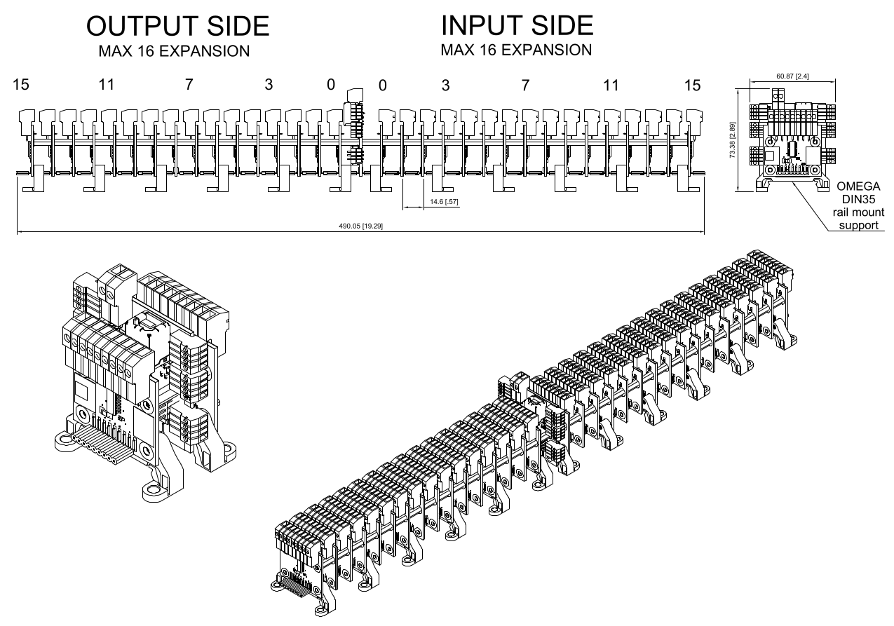

# IO_DECODER BASE
# IO_DECODER EXPANSION_8

## Index

- [**Features**](#features)  
- [**Pinout**](#pinout)  
- [**Usage**](#usage)  
- [**Hardware**](#hardware)  
- [**Authors**](#authors)  

[📖 Manual english]({{ site.baseurl }}/README.en.md)  
[📖 README](../README.md) | [🏠 Project Home]({{ site.baseurl }}/index)  

---

## Features

The system consists of a main board that carries the microcontroller with the USB connection and the peripherals provided by the installed firmware. It also provides the buses for connecting input and output expansion boards. These expansion boards are the same for both input and output and can be freely swapped between the two buses. The main board PCB indicates the bus connector for the INPUT side and the OUTPUT side. The [**Pinout**](#pinout) and [**Usage**](#usage) sections contain diagrams illustrating the installation and electrical connection methods. 

[back to index](#index) 

## Pinout

### io_decoder base board
#### Features dependent on the USB board hardware and firmware
  - **Firmware 101**
    - Quadrature encoders: 4 @5Vdc
    - DAC: 2 @8bit 5Vdc
    - ADC: 3 @10bit 5Vdc  
  

### io_decoder expansion_8 board used as input
  - **Digital inputs**: 8-128 (16 expansions) freely configurable with 8-pin expansion boards. Only dry contacts between the common pin and the digital input are accepted as valid inputs.  
  

### io_decoder expansion_8 board used as output
  - **Digital outputs**: 8-128 (16 expansions) freely configurable with 8-pin expansion boards. Each output can drive a load of 50mA@30Vdc with a maximum of 300mA per expansion board.  
  

[back to index](#index) 

## Usage

[back to index](#index) 

## Hardware
For prototypes, or integration support, please use the [✉️ Contact]

[back to index](#index) 

## Authors

Roberto "bobwolf" Sassoli

[🔝 back to index](#index) | [📖 Manual english]({{ site.baseurl }}/README.en.md)  
  
[📖 README](../README.md) | [🏠 Project Home]({{ site.baseurl }}/index)  

Copyright (c) 2026 [bobwolf]

<footer style="padding: 20px 0; text-align: center; color: #666; font-size: 0.9em;">
  
<strong>io_decoder</strong> - Driver Open Source per LinuxCNC

  

    <a href="mailto:io.decoder.rst%40gmail.com" style="color: #1e6bb8; text-decoration: none;">✉️ Contact</a> | 
    <a href="https://github.com/bobwolfrst/io_decoder-linuxCNC" style="color: #1e6bb8; text-decoration: none;">💻 GitHub Repository</a>
  

  
© 2026 - Creato da bobwolfrst. Rilasciato sotto licenza GPL.

</footer>