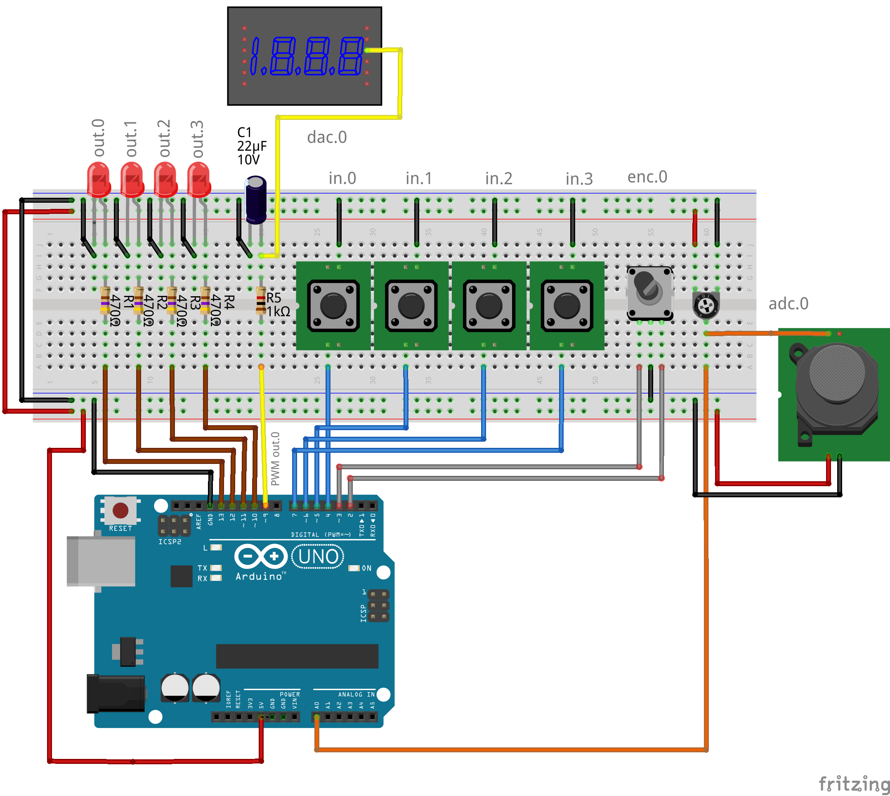

<style>
  .nav-container {
    position: sticky;
    top: 0;
    z-index: 9999;
    background-color: rgba(255, 255, 255, 0.95);
    backdrop-filter: blur(5px);
    border-bottom: 2px solid #1e6bb8;
    padding: 12px 0;
    margin-bottom: 25px;
    display: flex;
    justify-content: center;
    flex-wrap: wrap;
    gap: 12px;
  }
  .nav-btn {
    text-decoration: none !important;
    padding: 8px 18px;
    border-radius: 25px;
    font-size: 0.95em;
    font-weight: 600;
    transition: all 0.3s ease;
    border: 1.5px solid #1e6bb8;
    color: #1e6bb8 !important;
    display: flex;
    align-items: center;
    gap: 8px;
  }
  .nav-btn:hover {
    background-color: #1e6bb8;
    color: white !important;
    transform: translateY(-2px);
  }
  /* Stile specifico per il tasto contatto */
  .contact-btn {
    border-color: #28a745;
    color: #28a745 !important;
  }
  .contact-btn:hover {
    background-color: #28a745;
    color: white !important;
  }
  .lang-btn {
    background-color: #f8f9fa;
  }
  .download-btn {
    background-color: #e67e22 !important; /* Arancione */
    font-weight: bold;
    border: 2px solid #d35400;
  }
  .download-btn:hover {
      background-color: #d35400 !important;
      transform: scale(1.05);
  }
</style>

<div class="nav-container">
  <a href="https://bobwolfrst.github.io/io_decoder-linuxCNC/docs/index.it" class="nav-btn">🏠 Home</a>
  <a href="docs/README.it.md" class="nav-btn">📖 Manuale</a>
  <a href="https://github.com/bobwolfrst/io_decoder-linuxCNC/releases/latest/download/io_decoder_eval-v1.zip" class="nav-btn download-btn">📥 Download v1.0-eval</a>
  <a href="https://github.com/bobwolfrst/io_decoder-linuxCNC" class="nav-btn">💻 GitHub</a>
  <a href="mailto:io.decoder.rst%40gmail.com" class="nav-btn contact-btn">✉️ Contatto</a>
  <a href="https://bobwolfrst.github.io/io_decoder-linuxCNC/docs/demo_mode.en" class="nav-btn lang-btn">
     English
  </a>
</div>

  
# ⚡ Guida io_decoder_eval

> [!IMPORTANT]
> **Se riscontri l'errore `/dev/io_decoder: No such file or directory`:**
> Significa che il sistema non ha ancora creato il collegamento per la tua scheda. Hai due opzioni:
> 1. **Eseguire lo script per la regola udev** (metodo consigliato, vedi Punto 2).
> 2. **Specificare manualmente la porta** nel tuo file `.hal` aggiungendo il parametro `usb_port_name="/dev/ttyACMx"` (dove x è il numero della porta, es. `/dev/ttyACM0`).

Benvenuto nella guida alla **modalità demo/eval di io_decoder**. Segui questi passaggi per configurare la tua scheda in meno di 5 minuti.
---

### 1. Requisiti di Sistema
* **Sistema Operativo:** Linux con kernel Real-Time.
* **LinuxCNC:** Versione 2.8 o superiore.
* **Hardware:** Una porta USB libera. Arduino UNO R3.  
    **Compatibilità Hardware**  
    Il file .hex fornito è compilato specificamente per il microcontrollore ATmega328P con clock a 16MHz.

      ✅ Confermati: Arduino Uno R3 (originale e cloni), Arduino Nano (versione 5V) e schede compatibili al 100% con il layout Uno.

      ❌ NON Compatibili: Arduino Mega, Leonardo, Micro o qualsiasi scheda a 32-bit (es. Due, Zero, ESP32, STM32).  

    Da ora in poi in questa guida mi riferirò solo con arduino UNO.  

---

### 2. Installazione del Driver

Scarica e poi decomprimi [io_decoder_eval-v1.zip](https://github.com/bobwolfrst/io_decoder-linuxCNC/releases/download/v1.0-eval/io_decoder_eval-v1.zip).  
  
Sposta il file io_decoder.c del componente ed il file io_decoder_eval.hex dove ti resta più comodo;  
sposta il file io_decoder-keymap.cfg nella cartella della configurazione della macchina cnc, se vuoi usare la funzionalità keyboard.  

#### Comandi di installazione su macchina Linux
- compilare il componente:  
  Con il terminale aprire la cartella dove è salvato il file .c del componente e digitare:   
  ```bash
  sudo halcompile --install io_decoder.c
  ```

- definire porta USB:
1. Trova le informazioni sull’apparecchio USB  
    Collega il dispositivo e dai questo comando per trovare le sue caratteristiche:
    ```bash
    lsusb
    ```  
    Nella risposta al comando, con la scheda collegata all'usb, dovrebbe apparire una riga come questa:  
    **Bus 001 Device 008: ID 2341:0043 Arduino SA Uno R3 (CDC ACM)**    

2. Crea una regola udev  
    Aprire un terminale ed aprire la cartella delle regole con:  
    ```bash
    cd /etc/udev/rules.d/
    ```  
    Creare una regola per un device seriale USB:  
    ```bash
    sudo nano /etc/udev/rules.d/99-io_decoder.rules
    ```  
    Una volta eseguito, il terminale aprirà l'editor di testo nano. il numero 99 serve per dire al sistema di leggere     la regola per ultima, fra tutte quelle che ha. Il nome del file 99-io_decoder.rules è quello che ho scelto io; ma     questo può essere qualsiasi.  
    Incolla la seguente regola all'interno del file:  
    ```bash
    SUBSYSTEM=="tty", ATTRS{idVendor}=="2341", ATTRS{idProduct}=="0043", SYMLINK+="io_decoder", MODE="0666", ENV{ID_MM_DEVICE_IGNORE}="1"  
    ```

    Premi Ctrl + O per salvare (ti chiederà di confermare il nome del file e se non esiste questo verrà creato, premi     Invio).  
    Premi Ctrl + X per uscire dall'editor.  
    Così il tuo device sarà accessibile come /dev/io_decoder indipendentemente dalla porta fisica.  
    Se vuoi cambiare il nome del link simbolico dell'usb, modifica il valore scritto in SYMLINK+  
    >**ATTENZIONE**
    Con MODE="0666" vengono aperti i permessi di lettura/scrittura della USB a chiunque usi il sistema. Se vuoi tenere il sistema con delle sicurezze maggiori         devi creare, con i comandi di prompt, un gruppo che possa contenere la comunicazione con i permessi adeguati ed impostarlo nella stringa con                       GROUP="nome_tuo_gruppo".  

4. Ricarica le regole udev
    ```bash
    sudo udevadm control --reload-rules    
    sudo udevadm trigger
    ``` 

5. Verifica  
    Scollega e ricollega il dispositivo, poi verifica con:  
    ```bash
    ls -l /dev/io_decoder
    ```  
    Con queste impostazioni il valore di default dichiarato in fase di inizializzazione del componente è soddisfatto.
    Comunque il tutto è liberamente configurabile.  
  
#### Comandi di installazione su arduino UNO R3 
  
- Come caricare il firmware (Flashing)  
  Il file io_decoder_eval.hex deve essere trasferito sulla memoria dell'Arduino Uno. Scegli il metodo più adatto al tuo sistema operativo.

  - Opzione 1: Linux (Terminale) - Consigliato per utenti LinuxCNC
    Su Linux, lo strumento standard è avrdude. Apri il terminale nella cartella dove hai scaricato il file .hex ed esegui:

    ```Bash
    # Identifica la porta (solitamente /dev/ttyACM0 o /dev/ttyUSB0)
    ls /dev/tty*
  
    # Carica il firmware
    avrdude -v -patmega328p -carduino -P/dev/ttyACM0 -b115200 -D -Uflash:w:io_decoder_eval.hex:i
    ```
  
    Nota: Se ricevi un errore di "Permission denied", assicurati che il tuo utente sia nel gruppo dialout: sudo usermod -a -G dialout $USER e riavvia la sessione.

  - Opzione 2: Windows (Grafico)
    Se preferisci un'interfaccia visuale, usa XLoader (un tool gratuito e leggero):

    Scarica ed esegui XLoader.

    In Hex file, seleziona io_decoder_eval.hex.

    In Device, seleziona Uno(ATmega328).

    Seleziona la COM Port corretta.

    Imposta Baud rate a 115200.

    Clicca su Upload.

  - Opzione 3: Arduino IDE (Avanzato)
    Se hai già l'IDE di Arduino installato, puoi usare l'utility avrdude inclusa, ma la riga di comando rimane il metodo più veloce.

- ⚠️ Verifiche post-caricamento  
   Una volta completato l'upload:

  Il LED "L" (collegato al pin 13) dell'Arduino dovrebbe fare un breve lampeggio di reset.

  Ora puoi collegare l'Arduino al PC dove gira LinuxCNC e lanciare il comando lsusb per verificare che venga riconosciuto (ID 2341:0043).
  
- Un piccolo consiglio extra per te:
  Se usi un clone Arduino economico, la porta su Linux potrebbe chiamarsi /dev/ttyUSB0 invece di /dev/ttyACM0. Verifica con il comando dmesg | grep tty.  

---

### 3. Configurazione HAL
Aggiungi queste righe al tuo file di configurazione .hal per integrare la scheda:

```bash
   loadrt io_decoder firmware=255
   addf io_decoder.update	servo-thread
```  
  
#### Sinossi
- **loadrt io_decoder** [input=*num*] [output=*num*] [usb_port_name=*"string"*] [firmware=*num*] [verbose=*num*] [keymap_file=*"string"*] [uinput_chmod_cmd=*"string"*]  
   - **input**: questa versione ha il numero degli input fissato a 4. Se il parametro viene inserito il valore comunque viene settato a 4.  
   - **output**: questa versione ha il numero degli output fissato a 4. Se il parametro viene inserito il valore comunque viene settato a 4.  
   - **usb_port_name**: per poter nominare la porta a piacere e renderla fissa; vedere sezione [**definire porta USB**](./docs/README.it.md#comandi-di-installazione) . Valore di default "/dev/io_decoder"
   - **firmware**: In questa versione deve essere firmware=255  
   - **verbose**: per abilitare il livello dei messaggi di errore sulla GUI. il numero attiva il tipo di messaggio indicato e quelli di valore inferiore. default 1.  
     - 0=nessuno.
     - 1=componente. Invia messaggio in caso di disconnessione o di riavvio della comunicazione USB e segnala i messaggi della funzionalità keyboard se non è attivata per qualsiasi motivo.
     - 2=minimi. Messaggi di percentuale di errore parsing.
     - 3=tutti.
   - **keymap_file**: file di testo per impostare le corrispondenze [**input => simulazione tastiera**](./docs/README.it.md#keyboard) . Valore di default "io_decoder-keymap.cfg"
   - **uinput_chmod_cmd**: parametro stringa per dare i permessi di scrittura su UINPUT per la [**funzionalità di tastiera simulata**](./docs/README.it.md#keyboard) . Se si vuole essere sicuri di non dare i permessi il parametro deve essere "" (uinput_chmod_cmd="" senza niente all'interno delle virgolette) . Valore di default "chmod 0666 /dev/uinput" .    

- **Firmware 255**
  - versione speciale di valutazione per arduino UNO R3
  - 4 input digitali
  - 4 output digitali
  - Encoder in quadratura: 1 @5Vdc
  - DAC (PWM): 1 @8bit 5Vdc
  - ADC: 1 @10bit 5Vdc  

---

### 4. Test e Diagnostica
Verifica il funzionamento lanciando lo strumento di monitoraggio 'halshow' di linuxCNC:

Nella sezione Pins, cerca: 
io_decoder.in.00-0 -1 -2 -3 per vedere i segnali digitali in ingresso.  
io_decoder.out.00-0 -1 -2 -3 per commutare lo stato delle uscite digitali.  
io_decoder.enc.0 per vedere il conteggio dell'encoder.  
io_decoder.dac.0 per settare il valore del DAC.  
io_decoder.adc.0 per leggere il valore letto dall'ADC.
  
[Lista completa dei pin di HAL disponibili](./docs/README.it.md#pin).  
  
### 5. Collegamenti elettrici per questa versione  
  
  

#### Arduino UNO Eval Pinout (Firmware 255)

| Pin | Funzione | Direzione | Pull-up | Descrizione |
|:---:|:---|:---:|:---:|:---|
| **D2** | Encoder Phase A | Input | Interno | Interrupt Hardware (Fase A) |
| **D3** | Encoder Phase B | Input | Interno | ingresso digitale (Fase B) |
| **D4** | Input 0 | Input | Interno | Ingresso Digitale 0 attivo basso |
| **D5** | Input 1 | Input | Interno | Ingresso Digitale 1 attivo basso |
| **D6** | Input 2 | Input | Interno | Ingresso Digitale 2 attivo basso |
| **D7** | Input 3 | Input | Interno | Ingresso Digitale 3 attivo basso |
| **D9** | DAC (PWM) | Output | N/A | Uscita Analogica (PWM da filtrare) |
| **D10** | Output 3 | Output | N/A | Uscita Digitale 3 (LED) max 20mA |
| **D11** | Output 2 | Output | N/A | Uscita Digitale 2 (LED) max 20mA |
| **D12** | Output 1 | Output | N/A | Uscita Digitale 1 (LED) max 20mA |
| **D13** | Output 0 | Output | N/A | Uscita Digitale 0 (LED "L" Integrato) max 20mA |
| **A0** | ADC 0 | Input | No | Ingresso Analogico (0-5V) |
| **5V** | VCC | Power | N/A | Alimentazione Sensori/Encoder |
| **GND** | Ground | Power | N/A | Massa Comune |

---

Nel [manuale completo](./docs/README.it.md) spiega in dettaglio tutte le configurazioni e possibilità di questo sistema hardware/software per linuxCNC.

## 🔗 Risorse Utili
* 🏠 [Torna alla Home Page](https://bobwolfrst.github.io/io_decoder-linuxCNC/docs/index.it)
* 📖 [Consulta il Manuale Tecnico Completo](./docs/README.it.md)

<hr style="margin-top: 50px; border: 0; border-top: 1px solid #eee;">
<footer style="padding: 20px 0; text-align: center; color: #666; font-size: 0.9em;">
  <p><strong>io_decoder</strong> - Driver Open Source per LinuxCNC</p>
  <p>
    <a href="mailto:io.decoder.rst%40gmail.com" style="color: #1e6bb8; text-decoration: none;">✉️ Contatto</a> | 
    <a href="https://github.com/bobwolfrst/io_decoder-linuxCNC" style="color: #1e6bb8; text-decoration: none;">💻 GitHub Repository</a>
  </p>
  <p style="font-size: 0.8em;">© 2026 - Creato da bobwolfrst. Rilasciato sotto licenza GPL.</p>
</footer>